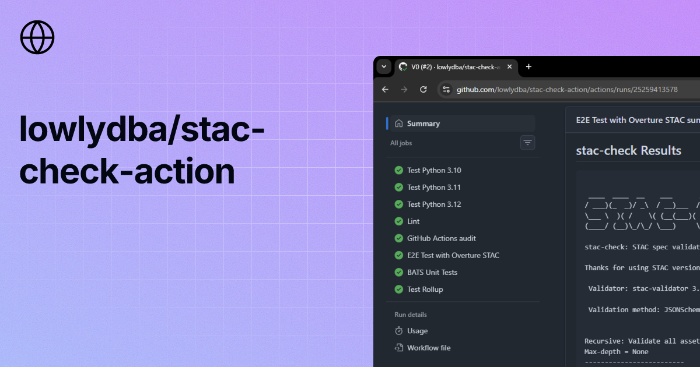

# stac-check-action

<p align="center">
  
</p>

[](https://github.com/lowlydba/stac-check-action/actions/workflows/ci.yml)
[](https://github.com/lowlydba/stac-check-action/rules)

Composite GitHub Action that runs [`stac-check`](https://github.com/stac-utils/stac-check) against local STAC files. Validates, lints, and checks best practices for items, collections, and catalogs.

Properties:

- Composite (no container, no external actions).
- Runner-native tools only (Python, pip, shell, gh).
- Local-only by default; no network requests for asset URLs.

## Contents

- [Usage](#usage)
- [Pinning](#pinning)
- [Inputs](#inputs)
- [Outputs](#outputs)
- [Examples](#examples)
- [Local-only behavior](#local-only-behavior)
- [Requirements](#requirements)
- [Security](#security)
- [Specification](#specification)

## Usage

```yaml
jobs:
  validate:
    runs-on: ubuntu-latest
    steps:
      - uses: actions/checkout@de0fac2e4500dabe0009e67214ff5f5447ce83dd # v6.0.2
      - uses: lowlydba/stac-check-action@v1.0.0
        with:
          stac-check-version: 1.9.1
          file: ./stac/item.json
```

## Pinning

Tags are immutable per this repo's [release ruleset](https://github.com/lowlydba/stac-check-action/rules). For supply-chain-sensitive workflows, pin to a commit SHA:

```yaml
- uses: lowlydba/stac-check-action@<full-commit-sha> # v1.0.0
```

[Dependabot](https://docs.github.com/en/code-security/dependabot/working-with-dependabot/keeping-your-actions-up-to-date-with-dependabot) keeps SHA-pinned actions current.

## Inputs

| Input | Description | Allowed Values | Default |
|-------|-------------|----------------|---------|
| `stac-check-version` (required) | Exact version (e.g. `1.9.1`) or `latest` | string | |
| `file` (required) | Path to local STAC file | string | |
| `recursive` | Recursively validate related local objects | `'true'` / `'false'` | `'false'` |
| `max-depth` | Maximum recursion depth (requires `recursive: true`) | integer | |
| `validate-assets` | Validate local asset paths (no network) | `'true'` / `'false'` | `'false'` |
| `pydantic` | Use stac-pydantic for validation | `'true'` / `'false'` | `'false'` |
| `verbose` | Verbose error messages | `'true'` / `'false'` | `'false'` |
| `fast` | Fast validation, no geometry/linting | `'true'` / `'false'` | `'false'` |
| `fast-linting` | Fast validation with linting, no geometry | `'true'` / `'false'` | `'false'` |
| `output-file` | Save CLI output to file (requires `recursive: true`) | string | |
| `config` | Path to config file or inline YAML (sets `STAC_CHECK_CONFIG`) | string | |
| `job-summary` | Write results to job summary | `'true'` / `'false'` | `'true'` |
| `comment-pr` | Post results as PR comment (requires `pull-requests: write`) | `'true'` / `'false'` | `'false'` |
| `extra-args` | Extra CLI arguments, appended last | string | |

## Outputs

| Name | Description |
|------|-------------|
| `valid` | Authoritative validation result. `true` if no failure markers in stac-check output, else `false`. |
| `exit-code` | Raw stac-check exit code. Not authoritative in recursive mode (upstream returns `0` even on failures); prefer `valid`. |
| `log-path` | Path to captured stac-check stdout/stderr. Set on every invocation, including early-exit errors. |

## Examples

PR comment with fast linting and asset validation:

```yaml
jobs:
  validate:
    runs-on: ubuntu-latest
    permissions:
      pull-requests: write
    steps:
      - uses: actions/checkout@de0fac2e4500dabe0009e67214ff5f5447ce83dd # v6.0.2
      - uses: lowlydba/stac-check-action@v1.0.0
        with:
          stac-check-version: 1.9.1
          file: ./stac/collection.json
          fast-linting: true
          comment-pr: true
          validate-assets: true
```

Inline config:

```yaml
- uses: lowlydba/stac-check-action@v1.0.0
  with:
    stac-check-version: 1.9.1
    file: ./item.json
    config: |
      linting:
        check_geometry: false
        bloated_links: true
      settings:
        max_links: 10
```

## Local-only behavior

By default, validation only touches local files checked out in the workspace. No outbound network requests are made to resolve remote URLs. This keeps runs fast, deterministic, and safe on restricted runners.

`validate-assets: true` checks local asset paths only; `--no-assets-urls` is enforced. To validate remote URLs, pass `--assets` via `extra-args` to opt in.

## Requirements

- Runner with Python 3.10+ and pip pre-installed.
- `stac-check` version published on PyPI and compatible with Python 3.10+.

## Security

- No external action dependencies.
- Minimal permissions; `pull-requests: write` only when `comment-pr: true`.
- No network access required for validation.
- Pin `stac-check-version` to an exact version in production. `latest` is for non-critical workflows.

See [SECURITY.md](./SECURITY.md) for the reporting policy.

## Specification

See [SPEC.md](./SPEC.md) for the full technical specification.
